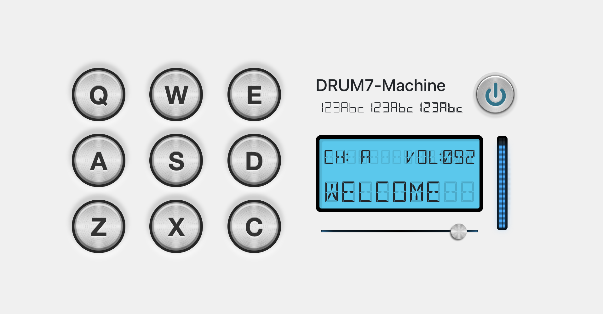

# FRONT END LIBRARIES PROJECT | BUILD A DRUM MACHINE

> This is the third project of _freeCodeCamp "Front End Libraries Projects" Certification_

## HOW TO USE

### 1. Install all dependencies: 
```bash
$ npm install
```

### 2. Run the project in dev mode:
```bash
$ npm start
```

### 3. Open Browser
Open [http://localhost:3000](http://localhost:3000) with your browser to see the result.


## Technology Stack

- **ReactJS**: frontend library (set up with [create-react-app](https://github.com/facebook/create-react-app))
- **Bootstrap**: CSS framework
- **Bootstrap Icons**: official bootstrap icons library
- **SASS**: CSS pre-processors

## SUMMARY

You can use any mix of HTML, JavaScript, CSS, Bootstrap, SASS, React, Redux, and jQuery to complete this project. You should use a frontend framework (like React for example) because this section is about learning frontend frameworks. Happy coding!

### User Stories

|    US    |        Description        |
| :------- | :------------------------ |
| **#1**:  | I should be able to see an outer container with a corresponding `id="drum-machine"` that contains all other elements. |
| **#2**:  | Within `#drum-machine` I can see an element with a corresponding `id="display"`. |
| **#3**:  | Within `#drum-machine` I can see 9 clickable drum pad elements, each with a class name of `drum-pad`, a unique id that describes the audio clip the drum pad will be set up to trigger, and an inner text that corresponds to one of the following keys on the keyboard: `Q`, `W`, `E`, `A`, `S`, `D`, `Z`, `X`, `C`. The drum pads MUST be in this order. |
| **#4**:  | Within each `.drum-pad`, there should be an HTML5 `audio` element which has a `src` attribute pointing to an audio clip, a class name of `clip`, and an id corresponding to the inner text of its parent `.drum-pad` (e.g. `id="Q"`, `id="W"`, `id="E"` etc.). |
| **#5**:  | When I click on a `.drum-pad` element, the audio clip contained in its child `audio` element should be triggered. |
| **#6**:  | When I press the trigger key associated with each `.drum-pad`, the audio clip contained in its child audio element should be triggered (e.g. pressing the Q key should trigger the drum pad which contains the string "Q", pressing the W key should trigger the drum pad which contains the string "W", etc.). |
| **#7**:  | When a `.drum-pad` is triggered, a string describing the associated audio clip is displayed as the inner text of the `#display` element (each string must be unique). |
